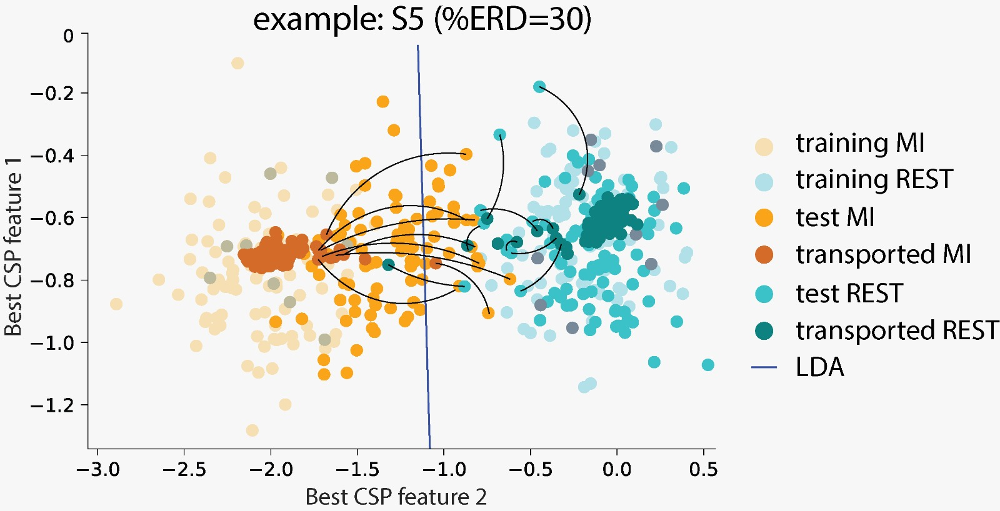

# COADAPTIVE BCI BASED ON BACKWARD OPTIMAL TRANSPORT FOR DOMAIN ADAPTATION

You will find here Python notebook demos ([Colab](https://colab.research.google.com) notebooks) that would show you how the backward formulation of optimal transport for domain adaptation ([BODTA](https://github.com/vpeterson/otda-mibci)) can be used to improve movement decoding. 

The demos uses artificially generated data, following [PySimMIBCI](https://github.com/catalinamagalvan/PySimMIBCI) pipeline. This proyect is a follow up of our previous publicaction: "Transfer Learning based on Optimal Transport for Motor Imagery Brain-Computer Interfaces", by Victoria Peterson, Nicolás Nieto, Dominik Wyser, Olivier Lambercy, Roger Gassert, Diego H. Milone and Ruben D. Spies

Three notebook examples are provided, each one testing one of the following hypothesis:

"BOTDA can succesfully make the adaption only if:

H1) The task is performed correctly (no failed trials) regardless of ERD
H2) The EEG patterns provided by the user correspond to the mental task to be performed
H3) The calibration data, used to train the decoding model, contains discriminable ERD patterns

#---- RUNNING THE NOTEBOOK --- 

Notebook are written to be easily run in Colab. In order to run the notebooks, you should follow these simple steps:

1. Make a copy of the used data folder into your Drive. Click [here](https://drive.google.com/drive/folders/1fk8wIGDzArMl61fpPCJElyEbVRXbQjpW?usp=drive_link) to download the folder.
2. In GitHub, go to a given notebook. Click the "Open in Colab" button on the top of the file.
3. Make a local copy of the notebook.
4. Run the notebook.

##### And you are ready. Happy coding!

